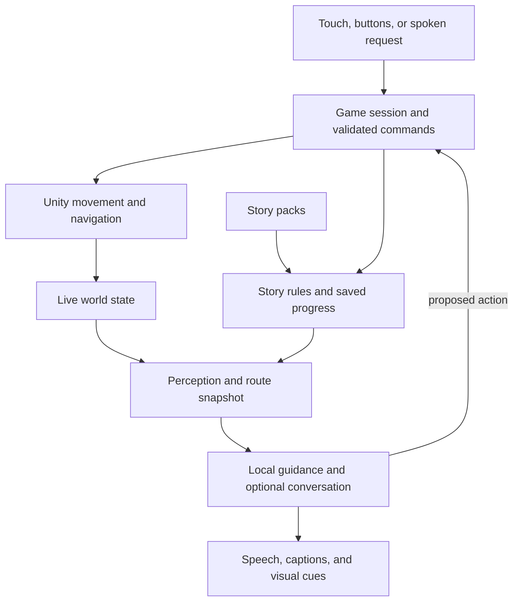

**Lantern: 3D port assessment and proposed plan**

Prepared for T-money on 4 September 2026. Status: recommendation for discussion; implementation has not started.

I recommend a full Unity client using **Unity 6.3 LTS and the Universal Render Pipeline (URP)**, with a portable C# story core and focused native iOS adapters for speech and audio. Start with one polished, accessible playable area before committing to the complete content migration. This recommendation assumes iPad/iPhone remain the first release target, based on the current project; the exact device and the child's preferred visual/control settings still need confirmation.

The strongest reason to port is the complete production workflow: authored levels, rigged characters, animation, navigation, camera control, profiling, and reusable accessibility presentation. Changing engines alone will not make the characters recognizable. Asset quality, art direction, and her playtest results must be explicit deliverables.

This assessment covers the current working tree on `claude/great-ramanujan-e6gw7u`, based on commit `1883157`, including its existing uncommitted visual overhaul and imported assets. It combines source inspection, the existing domain tests, and current official engine documentation. No new device build, GPU profile, or playtest was performed. Consequently, it explains implementation constraints but does not establish which code or assets are in the build she last played.

**There is useful work to preserve.**

The app is native SwiftUI/UIKit on iOS 18+, with a non-AR RealityKit view. The current camera follows the player in third person. The README's first-person description and some older art-pipeline notes lag behind the implementation. [Project configuration](/Users/taurusomejia/Documents/Projects/Aspire/project.yml), [world view](/Users/taurusomejia/Documents/Projects/Aspire/App/World/WorldView.swift:25), [camera update](/Users/taurusomejia/Documents/Projects/Aspire/App/World/WorldView.swift:257).

| Area | What exists | Port treatment |
| --- | --- | --- |
| Story content | Three regions/scenes, six quests, three companions, dialogue, songs, ability secrets, and progression conditions in JSON | Retain authored content and stable IDs; validate imports |
| Domain rules | 23 Swift source files, about 2,661 lines in StoryEngine; snapshots, guidance, difficulty, saves, memory, provider contracts | Translate the rules into ordinary C# with no Unity scene dependencies |
| App layer | 34 Swift files, about 7,275 lines, including rendering, UI, speech, and orchestration | Rebuild Unity presentation and input; adapt selected native services |
| Rendering/art | Procedural world plus 12 USDZ files; 11 of 25 scene entity entries name a model; fox and bunny name models, butterfly does not | Reuse suitable source art, but create a coherent character/environment pipeline |
| Sound | PHASE spatial sources, narration ducking, CoreMotion headphone tracking, speech synthesis, and 62 WAV files on disk | Preserve the behavior and assets; verify sound quality and licensing per asset |
| Accessibility | Spoken calibration, three contrast themes, large controls, captions, VoiceOver button path, freeze-and-explain, adaptive help | Treat these as required port features, with improvements verified by use |

The entity count includes the companion placeholder. File counts describe the current checkout, not production-ready asset counts. Asset and README totals are older than the directory contents.

The existing verification command, `swift test --package-path Packages/StoryEngine`, passed **115 tests with zero failures** during this review. These tests cover domain behavior and encoding; they do not verify rendering, microphone behavior, VoiceOver, or device performance.

**Several current choices explain why graphics improvements have not solved the experience.**

- High-contrast mode explicitly bypasses imported entity and companion models. It returns to procedural geometry, including box-built fox/bunny/butterfly fallbacks. A better imported fox therefore cannot improve that mode. Some semantic mappings also remain misleading: the singing crystal uses `door`, the bell tower uses `tree`, and the mice choir uses `mound`. [Model selection](/Users/taurusomejia/Documents/Projects/Aspire/App/World/WorldBuilder.swift:64), [companion fallbacks](/Users/taurusomejia/Documents/Projects/Aspire/App/World/VoxelWorld.swift:618), [story data](/Users/taurusomejia/Documents/Projects/Aspire/StoryPacks/ForestJourney/pack.json).
- The working tree already contains a smooth ground mesh, rounded avatar pieces, water motion, and model loading. It would be inaccurate to call the entire current world voxel-only. However, the player still has a procedural construction and tick-driven bob rather than a rigged locomotion system. [Terrain](/Users/taurusomejia/Documents/Projects/Aspire/App/World/VoxelWorld.swift:190), [avatar](/Users/taurusomejia/Documents/Projects/Aspire/App/World/VoxelWorld.swift:523).
- The world receives a single yellow-high-contrast boolean. The dark-on-light calibration changes the SwiftUI theme but is not passed as a distinct world palette. The new implementation should apply the selected profile consistently to UI and 3D presentation. [App configuration](/Users/taurusomejia/Documents/Projects/Aspire/App/Models/AppModel.swift:90), [theme](/Users/taurusomejia/Documents/Projects/Aspire/App/Theme.swift).
- Movement integrates X/Z coordinates within a square boundary. Autopilot turns toward an entity and advances directly; there is no obstacle/path solver in this movement code. Adding buildings, riverbanks, slopes, or bridge geometry requires new movement semantics, not just model replacements. [MovementController](/Users/taurusomejia/Documents/Projects/Aspire/App/Game/MovementController.swift:120).
- Perception is based on authored positions, distance, ability/quest rules, and hearing radius. It has no route geometry or obstruction input. A target can be audible across a river without being directly reachable; the port must distinguish these facts. [SnapshotBuilder](/Users/taurusomejia/Documents/Projects/Aspire/Packages/StoryEngine/Sources/StoryEngine/SnapshotBuilder.swift:18).
- The companion receives a useful world snapshot, but the provider returns unrestricted text. Spoken questions do not dispatch movement commands. Prompt instructions about factual directions are not an enforcement mechanism. Remote calls allow 30 seconds, and the ask flow does not invalidate old replies when context changes. [Brain contract](/Users/taurusomejia/Documents/Projects/Aspire/Packages/StoryEngine/Sources/StoryEngine/Companion/CompanionBrain.swift:35), [remote provider](/Users/taurusomejia/Documents/Projects/Aspire/Packages/StoryEngine/Sources/StoryEngine/Companion/OpenAICompatibleBrain.swift:58), [question flow](/Users/taurusomejia/Documents/Projects/Aspire/App/Game/GameViewModel.swift:718).
- Speech requests require on-device recognition only when the recognizer reports support. Offline scripted gameplay is established in the design; unrestricted offline voice input is not guaranteed on every device. [SpeechListener](/Users/taurusomejia/Documents/Projects/Aspire/App/Speech/SpeechListener.swift:30).

RealityKit is already a real 3D renderer, and the code does not demonstrate an intrinsic inability to render smooth characters. The concern is how much game infrastructure this project is implementing around it. The earlier [visual overhaul plan](/Users/taurusomejia/Documents/Projects/Aspire/Docs/VisualOverhaulPlan.md) chose to keep RealityKit and replace content. The present request calls for evaluating a full engine migration, which is the scope of this proposal.

**Unity is the best fit under the current platform assumption.**

These rankings are engineering judgments for Lantern, not measured benchmarks between engines.

| Candidate | Fit for this game | Main tradeoff | Recommendation |
| --- | --- | --- | --- |
| Unity 6.3 LTS + URP | Complete 3D production tools, mobile graphics, C# domain code, navigation, and documented native screen-reader support | Proprietary engine, license/account management, substantial UI rewrite, native speech/audio integration still required | Preferred |
| Godot 4.7.2 | Capable 3D engine with source ownership, scene composition, and no engine subscription | C# mobile exports remain experimental; mobile accessibility and native audio/speech integration need a device proof | Strong alternative if engine ownership outweighs integration risk |
| Unreal Engine 5 | Comprehensive animation, environments, and rendering | Higher complexity for this project's scale; mobile rendering has a different feature budget from desktop | Reconsider for a primarily desktop/console project or an experienced Unreal team |
| Keep RealityKit | Maximum Swift and Apple framework reuse | Continues the custom game-tooling work and Apple-specific client | Does not satisfy the requested move to a comprehensive game engine |

URP explicitly targets graphics across mobile, PC, and console. Unity's Navigation package supplies navigation meshes, paths, obstacles, and links, which fit assisted walking through an authored world. I would use these established systems and keep custom code focused on Lantern's guidance and accessibility. [URP documentation](https://docs.unity3d.com/6000.3/Documentation/Manual/universal-render-pipeline.html), [AI Navigation documentation](https://docs.unity3d.com/6000.3/Documentation/Manual/com.unity.ai.navigation.html).

Unity 6.3's Accessibility module supports VoiceOver on iOS/macOS, TalkBack on Android, and Narrator on Windows. It does **not** automatically make the game accessible: we must create and maintain the semantic hierarchy, focus, labels, actions, and announcements. Screen-reader behavior belongs in the first device milestone. [Accessibility module and limitations](https://docs.unity3d.com/6000.3/Documentation/Manual/accessibility/module-intro.html).

Godot 4.7.2 is the current stable release listed by its archive. Godot uses AccessKit for screen readers; AccessKit's current repository now lists Android and iOS adapters. Older claims that AccessKit is desktop-only are outdated. That alone does not prove integration in a particular Godot export. I would validate the exact Godot release on the target device before treating mobile VoiceOver parity as solved. Its current export documentation still marks C# iOS support experimental; typed GDScript is an alternative, with native adapters where needed. [Godot releases](https://godotengine.org/download/archive/), [Godot accessibility](https://docs.godotengine.org/en/4.7/tutorials/ui/creating_applications.html), [AccessKit adapters](https://github.com/AccessKit/accesskit#platform-adapters), [Godot iOS export](https://docs.godotengine.org/en/stable/tutorials/export/exporting_for_ios.html).

Unreal can ship mobile games, but its desktop showcase features should not drive an iPad decision. Epic documents mobile-specific rendering compromises and says Lumen does not currently work on iOS/iPadOS. This does not prevent attractive stylized graphics; it reduces the value of choosing Unreal for its flagship desktop rendering. [Mobile optimization](https://dev.epicgames.com/documentation/unreal-engine/performance-and-optimization-for-mobile-in-unreal-engine), [Lumen on mobile](https://dev.epicgames.com/documentation/unreal-engine/using-lumen-global-illumination-on-mobile-in-unreal-engine).

Unity 6.3 LTS is supported through December 2027. Pin a stable patch and compatible packages during the initial device proof. Unity also recommends its supported Update releases for new projects; selecting LTS here is a deliberate choice to keep the migration stable, with upgrades evaluated against actual platform needs. [Unity support policy](https://unity.com/releases/unity-6/support).

Unity Personal is free for eligible individuals/organizations below its revenue/funding threshold; a free game does not by itself establish eligibility. Godot is MIT-licensed. Both approaches can use our own AI infrastructure. A Unity client does not require this proposal to adopt hosted gameplay services. [Unity Personal eligibility](https://unity.com/products/unity-personal), [Godot license](https://godotengine.org/license/).

**The proposed structure keeps story rules separate from the engine.**

| Boundary | Responsibility |
| --- | --- |
| `Packages/Lantern.Core` | Unity-independent C# contracts, progression, dialogue, memory, difficulty, calibration, scripted companion, and save migration |
| `Clients/Lantern.Unity` | Scene composition, prefabs, animation, rendering profiles, player/camera controllers, UI, and platform composition |
| Navigation and perception adapters | Read live entity transforms and valid routes; supply plain data to the core and companion |
| Accessibility presentation | Reusable accessible controls, focus/announcement ownership, text scaling, world palettes, and motion preferences |
| Native iOS adapters | Speech recognition/synthesis, headphone tracking, supported haptics, and an initial PHASE audio integration |
| Existing `StoryPacks` and source assets | Authoritative narrative/identity data and tracked original art; build-time import into the client |
| Optional companion service | A small Dockerized HTTP service for a parent-configured model, with timeouts and provider-independent contracts |

These are proposed paths and boundaries, not newly created projects. Use ordinary classes and explicit dependencies. Avoid reproducing the 816-line GameViewModel as one large MonoBehaviour; separate quest interaction, dialogue/song sessions, companion conversation, and movement orchestration.

Unity should own the full client lifecycle. Keeping SwiftUI around a Unity view could reduce an initial UI rewrite, but would leave two application layers coordinating input, lifecycle, audio, and state. Unity as a Library also documents full-screen rendering constraints. A complete Unity client with bounded native adapters is the cleaner long-term choice for this requested port. [Unity as a Library limitations](https://docs.unity3d.com/6000.3/Documentation/Manual/UnityasaLibrary-iOS.html).

Swift files cannot simply become Unity C# scripts. Port the core behavior using representative input/output fixtures from the Swift implementation. Preserve stable IDs and JSON meanings, including per-companion text, optional fields, flag arrays, and ISO-8601 dates. Keep the Swift implementation available as a comparison until parity is established.

The native bridge is feasible through Unity's iOS plugin boundary, but integration still needs proof. Start by retaining PHASE for positional guidance on iOS, behind an interface, and avoid playing the same sources through both audio engines. One audio-session coordinator must handle microphone activation, narration, screen-reader speech, ducking, headphone routes, and interruptions. Test head tracking without tying the camera to head motion. A Unity spatial-audio replacement can be evaluated later against localization quality; ordinary stereo panning is not evidence of PHASE parity. [Native iOS plugin interface](https://docs.unity3d.com/6000.3/Documentation/Manual/ios-native-plugin-create.html).

The optional AI service can run on infrastructure T-money controls. Keep local scripted help and saves in the client; no database or hosted account system is needed for the first port. Use parent-configured remote conversation only as an enhancement. Minimize transmitted child information and keep raw-audio/transcript retention off by default. GPU model hosting, if chosen, requires hardware-specific deployment planning rather than assuming every Docker host can run it efficiently.

**The companion should guide from authoritative game facts.**

Commands such as stop, explain, repeat, and help must take the local path. A request such as “take me to the tree” resolves an allowed entity ID, checks quest locks and route reachability, and invokes the same navigation controller as the visible assistance button. Ambiguous destinations get a short choice before movement begins. The model must not choose raw coordinates or grant progression flags.

Navigation and language must share a route. “The tree is to your right” describes a bearing; “walk around the rock, then follow the path” describes travel. Store these as distinct facts. Add route status, next waypoint, path length, interaction range, and relevant obstacles to the snapshot. Audible objects may remain perceptible when visually occluded; geometry must not indiscriminately remove those cues.

For exact guidance, compose directions from deterministic templates or validated fields. Optional generated personality lines must not replace those facts. Cancel superseded requests, tag responses with scene/request versions, and discard stale results. Proposed initial targets: stop/freeze by the next simulation update, local explanation beginning within one second, and remote conversation falling back after a roughly three-second foreground wait. These are goals to measure on device, not existing performance claims. Offline voice recognition remains dependent on supported device/language resources; visible and narrated controls must always work.

**The art and accessibility work is part of the port.**

Use smooth, stylized characters with distinct silhouettes, readable faces, rigged idle/walk/turn animations, and deliberate foreground/background separation. Preserve source Blender/FBX/GLB files, texture maps, clip names, scale conventions, and license records. Reacquire original files for reusable USDZ assets where possible; inspect imports rather than assuming conversion preserves rigs and materials.

Every hero asset needs a full-color presentation and high-contrast material variants that preserve its recognizable geometry. Simplification can reduce texture noise or decoration without turning a fox into boxes. A dedicated simplified silhouette mode can remain an option if she prefers it. Imported artwork should participate in accessibility settings.

Keep bloom modest and adjustable; high contrast is not equivalent to maximum brightness. Use a calm background, clear ground/path boundaries, controlled outlines, large targets, and more than color alone to distinguish interactions. Apply light-on-dark and dark-on-light to the world as well as the UI. Disable motion blur, depth-of-field blur, camera shake, and automatic cinematic orbiting initially. Camera distance, text size, outline width, effects, and motion assistance should be tunable through understandable presets previewed with her.

Keep movement on one simple control surface with release-to-stop, a large context action, Talk, and Help/Stop. Assisted travel follows the same collision-aware path as manual movement and yields immediately to the player. Retain a large-button path for VoiceOver, an explicit accessible freeze/explain action, and gesture alternatives so two-finger help does not depend on a gesture reserved by the operating system. Haptics are supplementary and require capability checks; the iPad experience must stand on visuals and audio.

Import legacy positions through one coordinate conversion: the old core describes forward as −Z, while the new Unity scene convention should be explicit. Verify left/right, front/back, elevation, head yaw, and audio position with known fixtures. Unity scenes should own the new physical placement; import old coordinates as starting positions and have runtime snapshots read live transforms. Narrative JSON continues to own entity identity and story rules. Do not maintain two independently edited sources of physical position.

For saves, introduce a versioned format and an idempotent importer for the existing `Documents/vault.json`. Preserve companion slots, quest flags, inventory, memories, avatar, calibration, and difficulty state. Keep a backup and never silently replace a failed migration with an empty vault. The current save stores the scene but not an exact player pose, so scene-spawn restoration is the honest legacy behavior. Test updates under the existing app identity for release; use a separate development identity for the prototype to avoid overwriting her installed game. [Current save format](/Users/taurusomejia/Documents/Projects/Aspire/Packages/StoryEngine/Sources/StoryEngine/SaveSlot.swift:39), [progress state](/Users/taurusomejia/Documents/Projects/Aspire/Packages/StoryEngine/Sources/StoryEngine/GameProgress.swift:5).

**The work should progress through concrete milestones.**

| Milestone | Deliverable | Exit condition |
| --- | --- | --- |
| 1. Baseline and contracts | Confirm her device, observe the current build, inventory source art, capture representative content/save fixtures, agree on visual/control presets | We can describe and reproduce the specific problems the port must improve |
| 2. Device feasibility | Unity iPad build with one rigged character, contrast variants, accessible menu, microphone/TTS, positional audio, pause/stop, and a path around an obstacle | Native audio and VoiceOver work in an installed build; controls and directions agree |
| 3. Fox Hollow slice | A polished 5–10-minute adventure with Ember, the oak, river, acorn, dialogue, a song, assisted movement, offline help, and optional model conversation | She can identify key objects, reach a target, interact, and recover from confusion with less assistance than the baseline |
| 4. Content and save migration | All three scenes, six quests, all companions/abilities, calibration, avatar, memories, and save import | Critical story paths and old-save continuation pass; every scene meets the accepted art/readability standard |
| 5. Device polish and release | Performance tuning, final audio/art, interruption recovery, accessibility regression pass, local release build and distribution preparation | Physical-device acceptance, repeatable builds, and successful update/migration verification |

The feasibility build must exercise screen-reader toggling, the microphone while world audio is active, headset disconnect/reconnect, background/resume, network loss, and stale AI replies. A build that works only in the editor has not passed this milestone.

Use a small critical regression set: progression/locks, companion-specific content, direction/route facts, freeze/stop precedence, fallback and cancellation, and save import. Reuse relevant existing cases and fixtures. Visual recognition, comfortable control, speech intelligibility, and screen-reader navigation require device observation and her feedback.

Target 60 fps on the chosen device and check frame pacing, memory, battery/thermal behavior, and a sustained session. If the hardware needs a 30 fps tier, make that an explicit measured choice. Preserve readable silhouettes and responsive controls before spending the budget on decorative effects. Art budgets should follow the measured scene, not a universal polygon-count promise.

For planning only, allow roughly **2–4 focused development weeks for the first credible playable slice**, and **8–14 person-weeks for an iOS-first port of the present scope** including that slice. These are low-confidence engineering estimates, not a commitment. They assume one experienced developer, access to the target device, reusable rigs/environment assets, and timely playtests. Custom art production, repeated usability changes, additional platforms, and unexpected native integration problems can extend the calendar substantially. Re-estimate after milestone 2.

The next proposed implementation task is milestones 1–3 in a separate Unity client, culminating in her playable Fox Hollow comparison. Commit to the full migration after that comparison establishes that the new foundation improves recognition, control, and guidance together.
